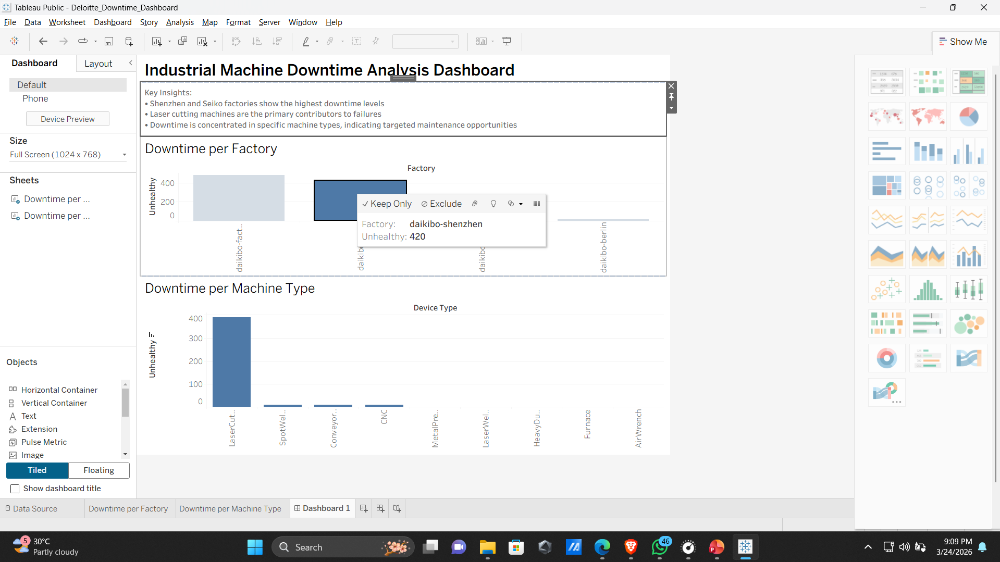

# 📊 Deloitte Data Analytics Project

## 🚀 Overview
This project analyzes industrial machine downtime and employee pay equality using real-world datasets. The goal is to identify operational inefficiencies and fairness issues across factories.

---

## 📁 Project Structure
- `data/` → Contains the equality dataset (Excel)
- `dashboard/` → Tableau dashboard screenshot
- `README.md` → Project documentation

---

## 🛠 Tools Used
- Tableau (Data Visualization)
- Microsoft Excel (Data Cleaning & Classification)

---

## 📊 Key Analysis

### 1. Machine Downtime Analysis
- Identified factories with highest downtime
- Laser cutting machines contribute most to failures

### 2. Pay Equality Analysis
- Created classification:
  - Fair (±10)
  - Unfair (>±10)
  - Highly Discriminative (>±20)
- Used Excel formulas to automate classification

---

## 📸 Dashboard Preview

---

## 💡 Insights
- Certain factories consistently show higher downtime → potential maintenance gaps
- Specific job roles show higher inequality → requires HR intervention

---

## 🎯 Outcome
This project demonstrates:
- Data cleaning and transformation
- Business insight extraction
- Dashboard creation using Tableau
- Real-world problem-solving approach
